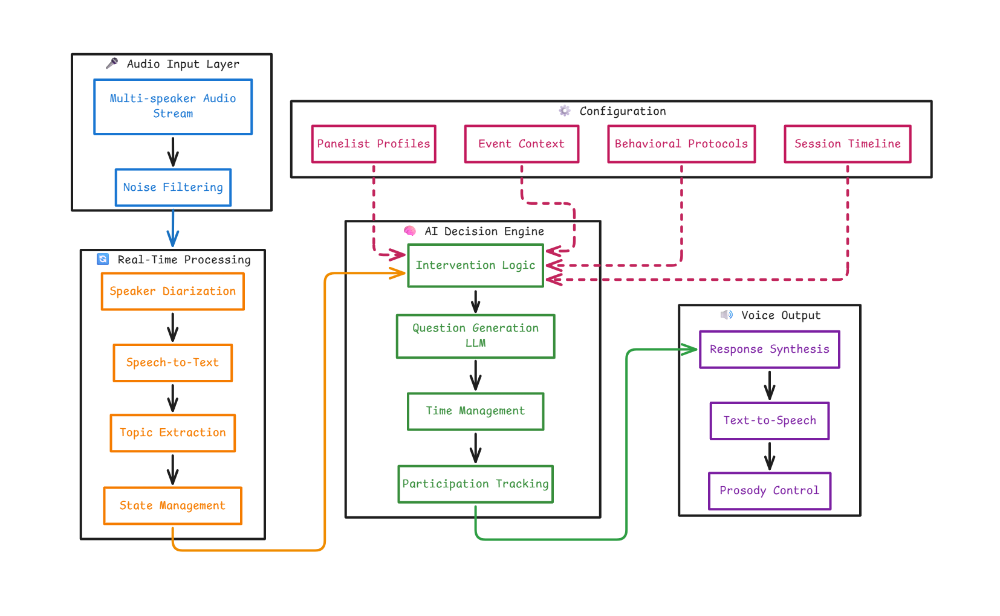

# AI Voice Moderator for Panel Discussions  
## Requirement Analysis Document

Reference: [AWS Voice AI Agents Workshop](https://catalog.workshops.aws/voice-ai-agents/en-US)

---

## 1. Executive Summary

This document analyzes requirements for developing an intelligent voice agent that autonomously moderates panel discussions. The AI moderator manages real-time conversations with human-like intervention, ensuring discussions remain productive, inclusive, and aligned with objectives while maintaining natural flow. Supports fixed sessions of 30 and 45 minutes.

---

## 2. System Purpose & Core Objectives

### 2.1 Primary Purpose

The AI voice moderator must serve as an autonomous moderator for live panel discussions, managing conversations in real-time with human-like intervention capabilities while maintaining natural conversation flow and strategically guiding discussions toward objectives.

### 2.2 Key Success Criteria

- **Improves Discussion Quality**: Elevates substance without dominating conversation
- **Manages Time Effectively**: Ensures comprehensive topic coverage within fixed durations
- **Encourages Balanced Participation**: Creates equitable speaking opportunities
- **Remains Unobtrusive**: Acts as "invisible hand" that enhances rather than controls

---

## 3. Pre-Configuration Requirements

### 3.1 Panelist Profile Configuration (FR-01)

**Required Profile Information:**
- **Expertise Areas**: Subject matter domains, specialized knowledge areas
- **Professional Background**: Career trajectory and relevant experience
- **Speaking Style**: Communication patterns (verbose/concise, technical/accessible)
- **Intervention Sensitivity**: Preferred frequency and style of moderator engagement

### 3.2 Event Context Configuration (FR-02)

**Essential Context Elements:**
- **Topic Structure**: Primary topic with prioritized subtopics
- **Session Objectives**: Specific goals (consensus building, perspective exploration)
- **Target Audience**: Demographics, expertise level, engagement expectations
- **Conversational Tone**: Desired atmosphere (professional, casual, academic)
- **Emotional Energy**: Target energy level (high-energy, reflective, balanced)

### 3.3 Behavioral Protocol Definition (FR-03)

**Protocol Components:**
- **Topics to Encourage**: Subjects for deep exploration, priority questions
- **Topics to Avoid**: Sensitive areas, off-limits subjects
- **Compliance Constraints**: Legal, ethical, organizational boundaries
- **Cultural Sensitivity**: Regional, demographic, contextual considerations

---

## 4. Core Capability Requirements

### 4.1 Active Listening & Speech Processing (FR-04, FR-05)

**Multi-Speaker Voice Recognition:**
- Real-time speaker diarization for 3-10 participants
- Continuous speech-to-text transcription with speaker attribution
- Overlapping speech handling without context loss
- Sub-2 second latency for real-time interaction

**Technical Implementation**: Amazon Transcribe with speaker identification, Amazon Chime SDK for audio capture

### 4.2 Conversation Monitoring & Analysis (FR-06, FR-07, FR-08)

**Topic Tracking Capabilities:**
- Identify and extract key discussion themes as they emerge
- Track topic evolution and progression throughout session
- Maintain awareness of covered vs. planned topics

**Quality Assessment Functions:**
- **Repetition Detection**: Identify circular arguments and restated points
- **Divergence Recognition**: Detect drift from defined objectives
- **Depth Analysis**: Assess surface-level vs. substantive discussion
- **Relevance Scoring**: Evaluate alignment with configured goals

**Technical Implementation**: Amazon Comprehend for topic modeling, Amazon Bedrock (Claude) for semantic analysis

### 4.3 Intelligent Intervention System (FR-09, FR-10, FR-11)

**Intervention Types:**

**Clarifying Questions:**
- Pose when terminology requires definition or statements contain ambiguity
- Example: "Could you elaborate on what you mean by 'algorithmic bias' in this context?"

**Perspective Introduction:**
- Introduce unexplored but relevant viewpoints
- Direct questions to underutilized panelist expertise
- Example: "Sarah, given your regulatory background, how do you see this intersecting with policy?"

**Redirection Interventions:**
- Guide back to core objectives when discussions drift
- Transition smoothly between planned topics
- Example: "Before we go further, let's address the governance challenges mentioned earlier."

**Natural Speech Pattern Requirements:**
- Conversational phrasing avoiding robotic scripts
- Appropriate hedging language ("perhaps," "it might be interesting")
- Natural interruption phrasing ("If I may interject...")
- Varied question structures preventing repetitive patterns

**Technical Implementation**: Amazon Bedrock (Claude) for question generation, Amazon Polly Neural with SSML for prosody

### 4.4 Participation Equity Management (FR-12)

**Monitoring Metrics:**
- Speaking time distribution across panelists
- Turn-taking frequency per participant
- Interruption patterns and question response allocation

**Balancing Strategies:**
- Direct questions to underrepresented voices
- Create conversational space for quieter participants
- Tactfully manage dominant speakers
- Example: "Michael, excellent points. I'd love to hear Jamie's perspective as well."

**Technical Target**: Gini coefficient <0.35 for speaking time equity

### 4.5 Temporal Awareness & Session Management (FR-13, FR-14, FR-15, FR-16)

**Session Structure**: Opening (0-10%) → Exploration (10-40%) → Development (40-70%) → Synthesis (70-85%) → Conclusion (85-100%)

**Pacing Interventions**: Gentle time cues, priority shifts, acceleration signals  
**Graceful Conclusion**: Synthesize key points, invite final thoughts, provide actionable insights

**Technical Implementation**: Amazon EventBridge for milestones, LLM-based summarization

### 4.6 Emotional Intelligence & Tone Adaptation (FR-17, FR-18, FR-19)

**Tone Dimensions**: Formality (Academic ↔ Casual), Energy (Reflective ↔ Energetic), Valence (Serious ↔ Lighthearted), Style (Directive ↔ Facilitative)

**Adaptive Triggers**: Rising tension → de-escalation; Low engagement → increased energy; Deep exploration → reflective patience

**Sensitive Topic Handling**: Acknowledge complexity, reframe constructively, maintain psychological safety

**Technical Implementation**: Sentiment analysis with dynamic TTS prosody adjustment

---

## 5. Technical Architecture Overview

### 5.1 System Architecture

### 5.2 AWS Service Mapping

| Component | AWS Service | Purpose |
|-----------|-------------|---------|
| Audio Capture | Amazon Chime SDK | Multi-party audio streaming |
| Speaker Identification | Amazon Transcribe | Real-time speaker diarization |
| Speech-to-Text | Amazon Transcribe | Continuous transcription |
| NLP Analysis | Amazon Comprehend | Topic extraction, sentiment analysis |
| Semantic Understanding | Amazon Bedrock (Claude) | Contextual analysis, relevance scoring |
| Question Generation | Amazon Bedrock (Claude) | Dynamic question formulation |
| Decision Orchestration | AWS Lambda + Step Functions | Intervention logic workflow |
| Text-to-Speech | Amazon Polly (Neural) | Natural voice with SSML |
| Configuration Store | Amazon DynamoDB | Profiles and context storage |
| Real-Time State | ElastiCache (Redis) | Conversation metrics |
| Time Management | Amazon EventBridge | Milestone triggers |
| Analytics | CloudWatch + S3 | Metrics and archival |

### 5.3 Processing Pipeline Flow

---

## 6. Non-Functional Requirements

### 6.1 Performance Requirements (NFR-01)

**Real-Time Latency Targets:**
- Speech-to-text: <2 seconds from utterance completion
- Intervention decision: <3 seconds
- Question generation: <2 seconds  
- Text-to-speech: <1.5 seconds
- **Total end-to-end: <8 seconds maximum**

**Reliability Standards:**
- System uptime: 99.9% during sessions
- Transcription accuracy: >95% word error rate
- Speaker attribution: >90% accuracy

### 6.2 Conversational Naturalness (NFR-02)

**Naturalness Criteria:**
- Conversational, non-robotic interventions
- Contextual references demonstrating active listening
- Varied question structures
- Natural interruption timing at conversational breaks

**Quality Metrics:**
- Panelist naturalness rating: >4.0/5.0
- Blind testing: listeners cannot reliably distinguish AI vs. human in short clips

### 6.3 Multi-Speaker Handling (NFR-03)

**Requirements:**
- Process overlapping speech from 2+ speakers
- Maintain context during rapid turn-taking
- Handle 3-10 simultaneous panelists
- Graceful degradation when separation is difficult

### 6.4 Minimal Disruption (NFR-04)

**Guiding Principle**: Felt but not dominant—panelists lead, moderator guides

**Success Metrics:**
- Panelist-to-moderator speaking ratio: 85:15 or better
- Intervention frequency: 6-10 per 30-min, 10-15 per 45-min session
- Satisfaction: "Felt heard and supported, not controlled"

---

## 7. Success Metrics & Evaluation

### 7.1 Quantitative Metrics

| Category | Metric | Target |
|----------|--------|--------|
| **Technical** | Transcription word error rate | <5% |
| | End-to-end latency | <8 sec |
| | System uptime | >99.5% |
| **Quality** | Topic coverage completeness | >85% |
| | Speaking time equity (Gini) | <0.35 |
| | Intervention helpfulness | >80% |
| **Time** | On-time completion | >90% ±2 min |
| | Critical topic coverage | 100% |
| **Satisfaction** | Panelist NPS | >40 |
| | Audience engagement | >4.0/5.0 |

### 7.2 Qualitative Success Criteria

**Success Indicators:**
- Panelists feel supported rather than controlled
- Interventions enhance flow rather than disrupt
- Diverse perspectives consistently surface
- Time constraints met without rushed feel

**Failure Indicators:**
- Frequent mis-timed interruptions
- Robotic or repetitive language
- Major topic omissions
- Panelist frustration

---

## 8. Risk Analysis & Mitigation

### 8.1 Technical Risks

| Risk | Impact | Mitigation |
|------|--------|------------|
| Transcription errors | High | Confidence scoring, silence during uncertainty |
| LLM hallucination | Medium | Template fallbacks, human review |
| High latency | High | Caching, parallel processing |
| Speaker diarization failure | Medium | Visual cues, manual fallback |

### 8.2 Conversational Risks

| Risk | Impact | Mitigation |
|------|--------|------------|
| Interrupts emotional moments | High | Sentiment-based suppression |
| Panelists ignore interventions | High | Escalation protocols, human backup |
| One speaker dominates | Medium | Progressive intervention urgency |
| Misinterprets relevance | Medium | Conservative thresholds |

### 8.3 Ethical Considerations

**Privacy & Consent**: Clear AI disclosure, explicit recording consent, data retention policies  
**Bias Mitigation**: Diverse training data, regular audits, manual overrides  
**Cultural Sensitivity**: Configurable norms, diverse testing, culturally aware prompts

---

## 9. Implementation Roadmap

### 9.1 Phased Development

**Phase 1 (Weeks 1-4)**: AWS infrastructure, audio pipeline, speaker diarization, LLM integration  
**Phase 2 (Weeks 5-8)**: Topic tracking, intervention engine, time management, detection algorithms  
**Phase 3 (Weeks 9-12)**: Response generation, TTS prosody, timing refinement, protocol enforcement  
**Phase 4 (Weeks 13-16)**: Equity tracking, tone adaptation, user testing, optimization

### 9.2 Critical Success Factors

1. **High-Quality Training Data**: Diverse panel discussions for validation
2. **Expert Collaboration**: Professional moderators capturing best practices
3. **Iterative Testing**: Real-world validation across diverse topics
4. **Continuous Feedback**: User input driving refinement
5. **Ethical Guardrails**: Robust protocols for sensitive topics

---

## 10. Conclusion

The AI Voice Moderator represents sophisticated orchestration of speech processing, natural language understanding, contextual awareness, and human-like interaction. Success requires balancing proactivity with subtlety, intelligence with humility, and responsiveness with restraint.

The core challenge lies not in individual technical components—which are mature—but in their intelligent integration to create a system that feels genuinely conversational, contextually aware, and strategically helpful. The moderator must be the "invisible hand" that elevates collective panel intelligence rather than showcasing its own capabilities.

By adhering to these requirements, leveraging AWS's AI services, and maintaining focus on conversational quality over technical complexity, the AI Voice Moderator can consistently deliver excellent, engaging, and insightful panel discussions.

---

**Document Status**: Requirements Analysis v1.0  
**Last Updated**: February 14, 2026  
**Reference**: [AWS Voice AI Agents Workshop](https://catalog.workshops.aws/voice-ai-agents/en-US)
